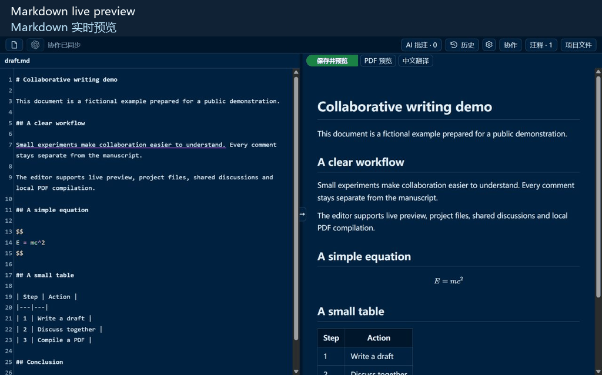
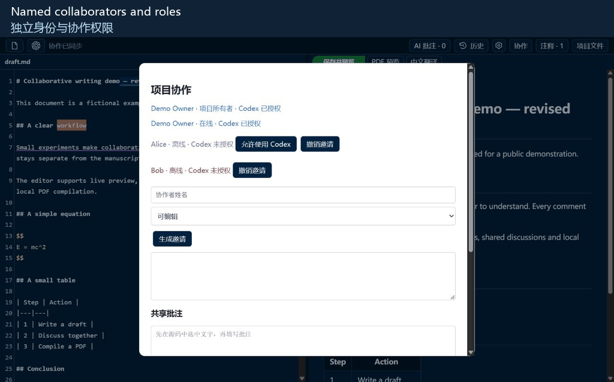
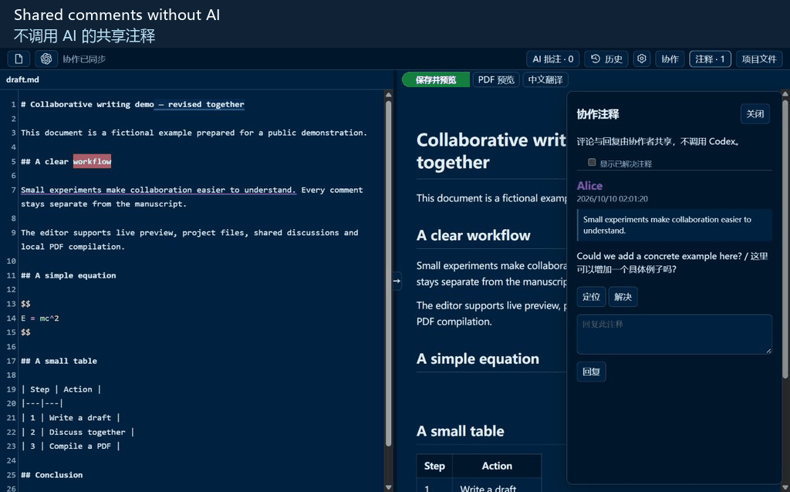
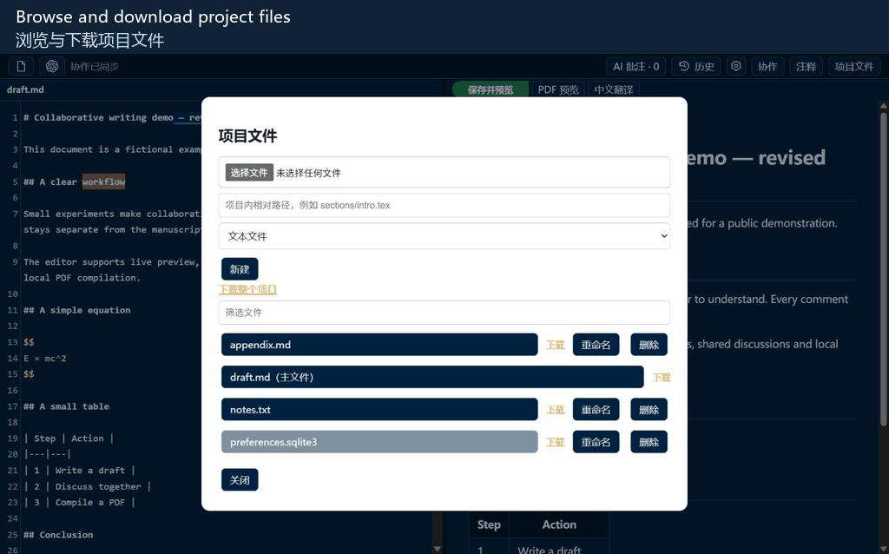
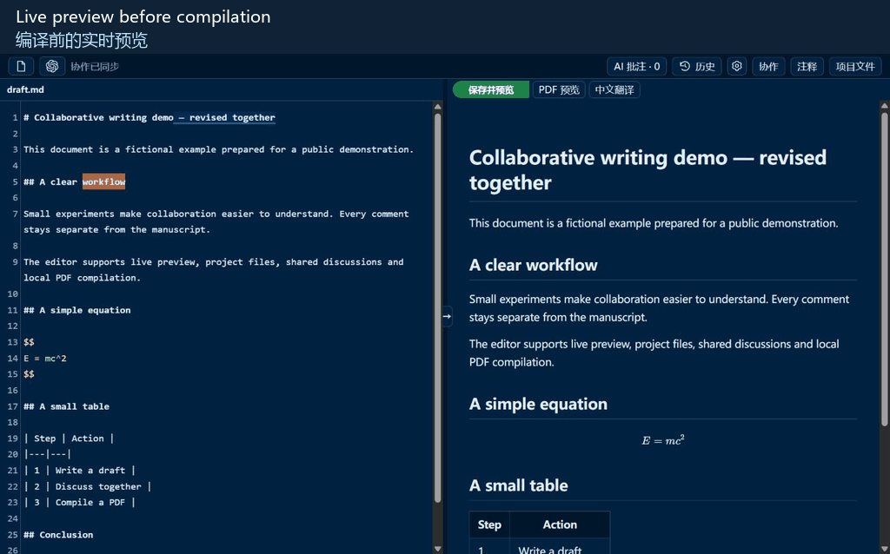
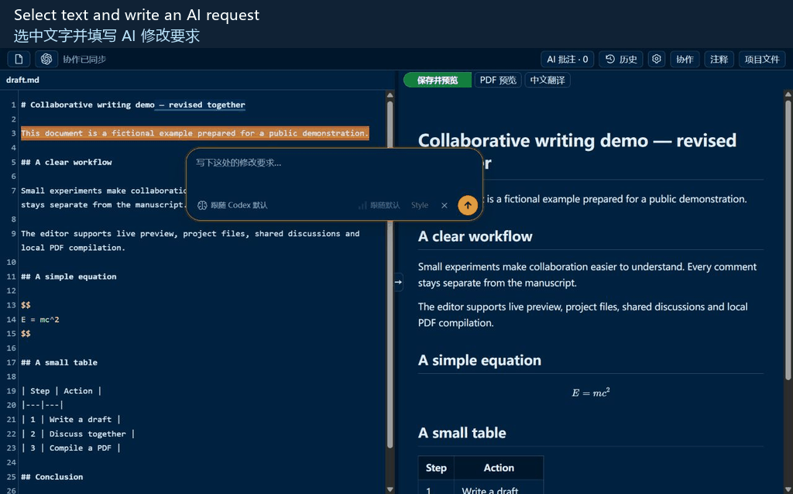
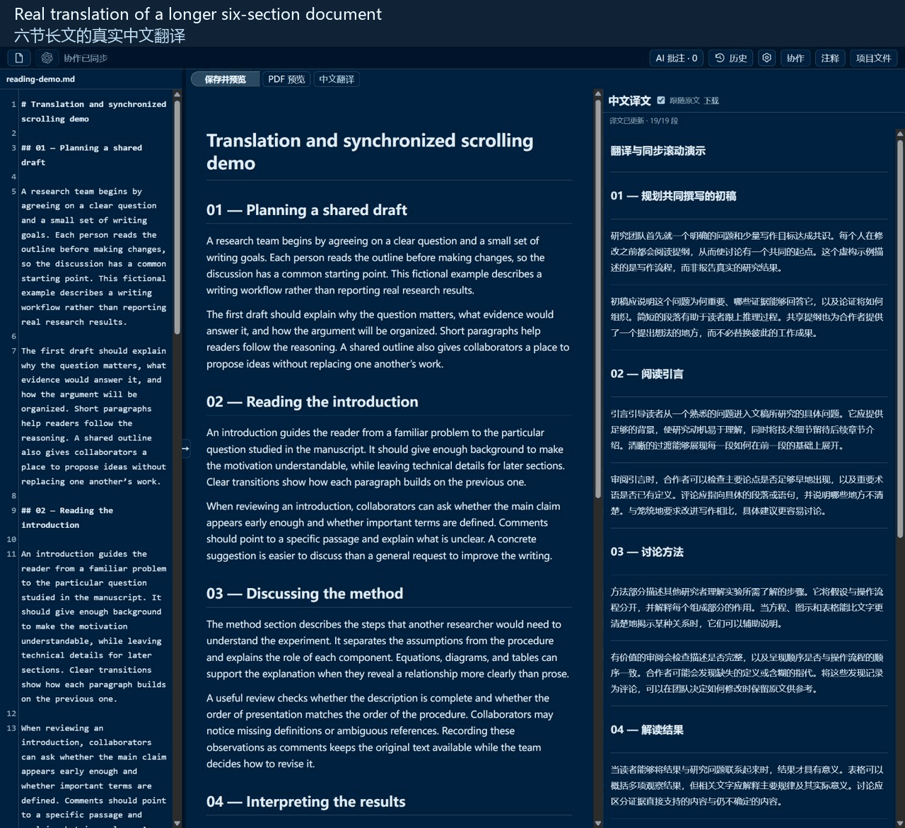
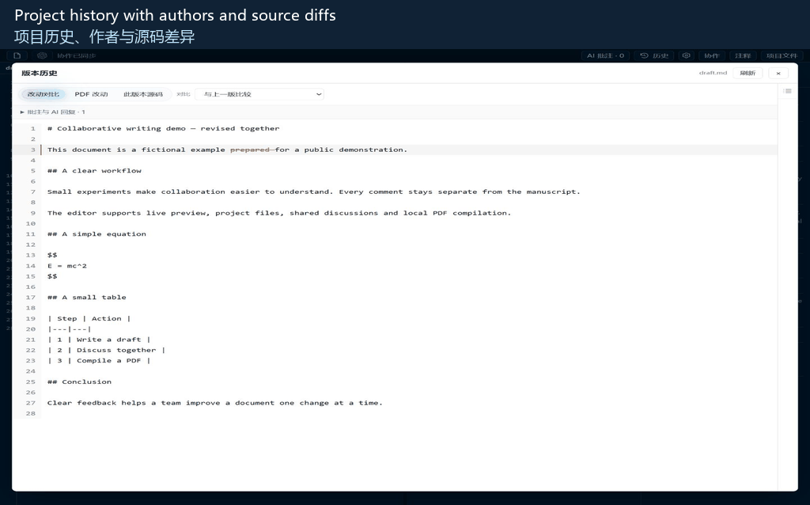

[English](README.md) · [简体中文](README.zh-CN.md)

# LaTeX Codex Collab

> [!WARNING]
> **Collaboration data security notice: this program currently provides no guarantee of data security during collaboration.**
> Collaborators are assumed to be trusted labmates or research partners. The program is not designed to securely isolate mutually untrusted users. Project file permission checks are not operating-system isolation, and local TeX compilation does not provide a security sandbox. Invite only people you trust, keep sensitive or confidential data out of shared projects, and do not use this program as a public collaboration service for strangers.

Edit LaTeX and Markdown beside your Codex conversation, with local PDF compilation, individual collaborator invitations and Chinese reading translation. This modified edition is based on LaTeX Codex.

## Features

- LaTeX/Markdown editing with autosave, Standard/Vim/Emacs, completion, formula previews and search/replace.
- Local XeLaTeX/pdfLaTeX/BibTeX, compilation logs, PDF download and hidden Windows compilation processes.
- PDF chapter/page navigation, text/box selection, zoom/pan and source ↔ PDF navigation.
- Markdown/Obsidian live HTML preview and optional PDF conversion with tables, callouts, equations and TikZ.
- Always-visible AI annotation list, batch Send, model/reasoning selection and writing-style prompts.
- Per-change Keep/Undo in source and temporary LaTeX PDF, with independent proofreading switches.
- Persistent project chat and optional review of main-chat/external TeX changes.
- Individual named invitations, author colors, online presence, non-overlapping edit merging and conflict protection.
- Owner-controlled Codex authorization; editors can compile without AI permission, viewers read only.
- Shared text/image/table discussion comments and replies, resolution and reopening, without AI calls.
- Project file browsing/editing, owner uploads/create/rename/delete, file/ZIP downloads and recoverable trash.
- Multiple projects on one gateway port, private local administration, project-scoped invitations and optional LAN/free-port detection.
- Optional Chinese reading pane, synchronized scrolling, incremental paragraph caching and downloadable copies.
- Source/PDF history comparisons, authorship, optional cached AI summaries and restoration.
- Eight interface languages, 14 palettes, local screenshot-derived themes and persistent preferences.

Read the [complete feature guide](docs/FEATURES.md), including permission boundaries, limitations and unresolved checks.

## Short demos

Recorded UI steps with fictional documents and test collaborators, with English/Chinese captions. The AI suggestion and Chinese translation are real results; playback pauses briefly at each step.

### Live preview and search

### Collaborators and owner-controlled Codex permission

### Comments, replies and resolved discussions

### Project file browsing and creation

### Markdown to local PDF

### AI annotations, Send and Keep/Undo

### Chinese translation and synchronized scrolling through a longer document

A six-section document demonstrates Chinese following English scrolling down and back up, staying in place when following is disabled, and realigning when enabled again. Approximately 24 seconds, with actual generated translations.

### Source history, authors and saved AI requests

## Get started

1. Download/clone this repository and open its folder in Codex.
2. Ask: **“Install latex-codex following AGENTS.md.”**
3. Start a new chat: **“Use latex-codex to open main.tex.”** Markdown notes work too.

See the [installation and launch guide](docs/INSTALL.md) for manual startup, collaboration and public tunnels. The installed plugin name remains `latex-codex`.

Collaboration is for trusted coauthors: the web APIs restrict project files, but local TeX compilation is not an operating-system sandbox. Installation, launch options and maintenance details are in [AGENTS.md](AGENTS.md).

## Origin and acknowledgments

This plugin is a modified derivative of [Fr0zenWatter/codex-latex-editor](https://github.com/Fr0zenWatter/codex-latex-editor/tree/main). Thank you to **Fr0zenWatter** and the original contributors for the foundation, and to the authors of bundled third-party libraries. Existing resource licenses are retained. This edition is not an official release or endorsement by the original author.
